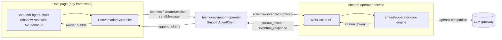
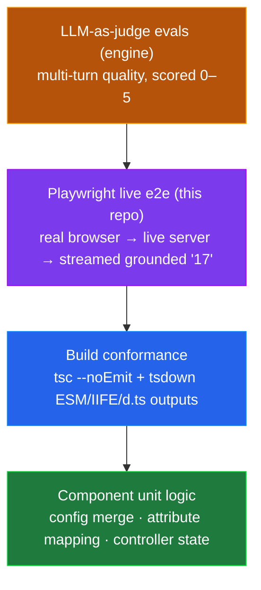

<p align="center">
  
</p>

<p align="center">
  <strong>A drop-in chat widget for your smooth-operator agent.</strong><br/>
  One <code>&lt;script&gt;</code> tag, one custom element, and you have a streaming, knowledge-grounded chat on any page. No React. No framework. No build step required.
</p>

<p align="center">
  <a href="./LICENSE"></a>
  
  
  
  <a href="https://lom.smoo.ai"></a>
</p>

---

`@smooai/chat-widget` is a **framework-light embeddable web component** that speaks the [smooth-operator](https://github.com/SmooAI/smooth-operator) WebSocket protocol via [`@smooai/smooth-operator`](https://github.com/SmooAI/smooth-operator). Drop a `<smooth-agent-chat>` element on a page, point it at a running agent service, and it handles the whole conversation loop: open the connection, create a session, send a message, and render the streamed assistant reply **token-by-token**.

It's a plain `HTMLElement` rendering into a shadow root — **no React, no Tailwind, no monorepo coupling.** The whole thing ships as ESM + a standalone IIFE bundle + type declarations, built with [tsdown](https://tsdown.dev).

---

## Quickstart

The fastest path — a plain `<script>` tag and one element:

```html
<!-- 1. Load the standalone bundle (auto-registers the custom element). -->
<script src="https://unpkg.com/@smooai/chat-widget/dist/chat-widget.global.js"></script>

<!-- 2. Drop the element. Point it at your smooth-operator WS endpoint + agent id. -->
<smooth-agent-chat
  endpoint="wss://realtime.prod.smooth-agent.dev/ws"
  agent-id="00000000-0000-0000-0000-000000000000"
  agent-name="Support"
></smooth-agent-chat>
```

That's it — a launcher button appears, the popover opens on click, and messages stream back live.

Prefer to mount it from JS?

```html
<script src="https://unpkg.com/@smooai/chat-widget/dist/chat-widget.global.js"></script>
<script>
  // The IIFE global exposes both `mount` (convenience alias) and `mountChatWidget`.
  SmoothAgentChat.mount({
    endpoint: 'wss://realtime.prod.smooth-agent.dev/ws',
    agentId: '00000000-0000-0000-0000-000000000000',
    agentName: 'Support',
    theme: { primary: '#7c3aed' },
  });
</script>
```

Or, in a bundler-based app:

```bash
pnpm add @smooai/chat-widget
```

```ts
import { defineChatWidget, mountChatWidget } from '@smooai/chat-widget';

// Declarative: register the element, then use <smooth-agent-chat …> in markup.
defineChatWidget();

// Or programmatic — create, configure, and append in one call:
const widget = mountChatWidget({
  endpoint: 'wss://realtime.prod.smooth-agent.dev/ws',
  agentId: '00000000-0000-0000-0000-000000000000',
});
widget.openChat();
```

> **Modes:** embeddable launcher + popover today; a full-page / inline mode is on the roadmap.

---

## Showcase: configure once, control imperatively

The element is a real `HTMLElement` — give it a ref and drive it:

```ts
import { mountChatWidget, type ChatWidgetConfig } from '@smooai/chat-widget';

const widget = mountChatWidget({
  endpoint: 'wss://realtime.prod.smooth-agent.dev/ws',
  agentId: '00000000-0000-0000-0000-000000000000',
  agentName: 'Aria',
  greeting: 'Hi! Ask me anything about our return policy.',
  placeholder: 'Type a message…',
  startOpen: false,
  theme: { primary: '#7c3aed' },
});

// Merge config overrides at runtime (re-renders):
widget.configure({ agentName: 'Aria (beta)' });

// Open / close the popover programmatically:
document.querySelector('#help')?.addEventListener('click', () => widget.openChat());
```

### Embedding API

| Surface | Description |
| --- | --- |
| `<smooth-agent-chat>` element | Custom element. Configure via HTML attributes (below). |
| `defineChatWidget()` | Register the custom element (idempotent). |
| `mountChatWidget(config, target?)` | Create + configure + append the element programmatically; returns it. |
| `element.configure(partialConfig)` | Merge config overrides (precedence over attributes); re-renders. |
| `element.openChat()` / `element.closeChat()` | Open / collapse the popover panel. |

### Attributes

| Attribute | Maps to | Required |
| --- | --- | --- |
| `endpoint` | `config.endpoint` (WS URL) | ✅ |
| `agent-id` | `config.agentId` | ✅ |
| `agent-name` | `config.agentName` | |
| `placeholder` | input placeholder | |
| `greeting` | opening assistant line | |
| `start-open` | start with panel open | |

### Config (`ChatWidgetConfig`)

```ts
interface ChatWidgetConfig {
  endpoint: string;   // smooth-operator WS URL
  agentId: string;    // UUID of the agent
  agentName?: string;
  userName?: string;
  userEmail?: string;
  placeholder?: string;
  greeting?: string;
  connectionErrorMessage?: string;
  startOpen?: boolean;
  theme?: ChatWidgetTheme; // color overrides
}
```

---

## Why this

| You want… | chat-widget gives you |
| --- | --- |
| Chat on a page in **5 minutes** | one `<script>` tag + one element |
| **No framework lock-in** | a vanilla custom element — works in React, Vue, Astro, plain HTML |
| **No CSS bleed** | renders into a shadow root; your styles and its styles never collide |
| **Real streaming** | tokens append to the assistant bubble as the agent thinks |
| **Typed, programmatic control** | `mountChatWidget` / `configure` / `openChat` with full d.ts |
| **Tiny footprint** | no React, no Tailwind, no Supabase — just the protocol client |

---

## Architecture



**On open**, the widget calls `client.connect()` then `createConversationSession({ agentId })`. **On send**, it calls `sendMessage({ sessionId, message })`, which returns a streaming `MessageTurn`; the widget async-iterates the turn, appending each `stream_token` to the in-progress assistant bubble, then awaits the terminal `eventual_response` for the authoritative final text. The protocol shapes are identical to `@smooai/realtime` — this is a client-library swap, not a protocol redesign.

---

## Test-driven by default — verified, not vibe-coded

The widget's credibility test is the one that matters most for a chat UI: **does a real browser render a real, streamed, knowledge-grounded answer against a live agent?** That's exactly what the Playwright live e2e proves.

`e2e/widget.live.spec.ts` spawns a real `smooth-operator-server`, seeds it with a distinctive knowledge-base fact —

> *"SmooAI's return window is exactly 17 days from delivery."*

— loads the **built** `<smooth-agent-chat>` widget in Chromium, types *"What is SmooAI's return window?"*, and asserts the streamed assistant bubble contains **`17`**. A grounded answer can't pass unless the full path works: shadow-DOM render → WS connect → session create → message send → token stream → RAG retrieval → final text.



The live e2e is **cost-gated** — it hits a real LLM gateway, so it only runs when both `SMOOTH_AGENT_E2E=1` and `SMOOAI_GATEWAY_KEY` are set; otherwise it skips cleanly. The gateway key only ever enters the spawned server's env — it is never logged or printed.

Run it:

```bash
pnpm build                       # tsdown → dist/ (the e2e loads the BUILT widget)
pnpm typecheck                   # tsc --noEmit
SMOOTH_AGENT_E2E=1 SMOOAI_GATEWAY_KEY=… pnpm test:e2e   # live, cost-gated
```

> The full quality pyramid spans repos: the engine's **408 unit tests + LLM-as-judge evals** (which caught a multi-turn defect that scored 1/5 → fixed → 5/5) sit above this widget's live render proof.

---

## Develop

```bash
pnpm install
pnpm build      # tsdown → ESM lib (dist/index.js) + IIFE bundle (dist/chat-widget.global.js) + d.ts
pnpm dev        # tsdown --watch
pnpm typecheck  # tsc --noEmit
```

Open `index.html` after a build to see the embed (point it at a live service to chat).

### Build outputs

| File | Format | Use |
| --- | --- | --- |
| `dist/index.js` | ESM | bundler hosts (`import …`) |
| `dist/index.d.ts` | types | TypeScript consumers |
| `dist/chat-widget.global.js` | IIFE | plain `<script>` embed (`window.SmoothAgentChat`) |

---

## Smoo-powered or bring-your-own

**Bring-your-own:** point `endpoint` at *any* smooth-operator-compatible WebSocket service — your own self-hosted [smooth-operator](https://github.com/SmooAI/smooth-operator) on EKS, a Lambda WS API, or a local dev server. The widget only needs a WS URL and an agent id.

**Smoo-powered:** let [**lom.smoo.ai**](https://lom.smoo.ai) host the agent service and hand you a `wss://…` endpoint + agent id — drop them into the element and you're live, no infra to run.

---

## Links

- [**lom.smoo.ai**](https://lom.smoo.ai) — hosted agent service
- [smooth-operator](https://github.com/SmooAI/smooth-operator) — the agent service this widget talks to
- [smooth-operator-core](https://github.com/SmooAI/smooth-operator-core) — the Rust engine behind it
- [smoo.ai](https://smoo.ai) — the product · [github.com/SmooAI](https://github.com/SmooAI) — more open source

## License

MIT — see [LICENSE](./LICENSE).
